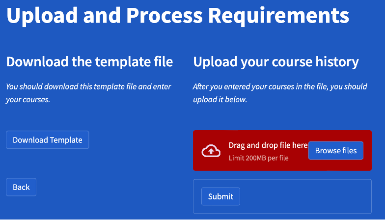
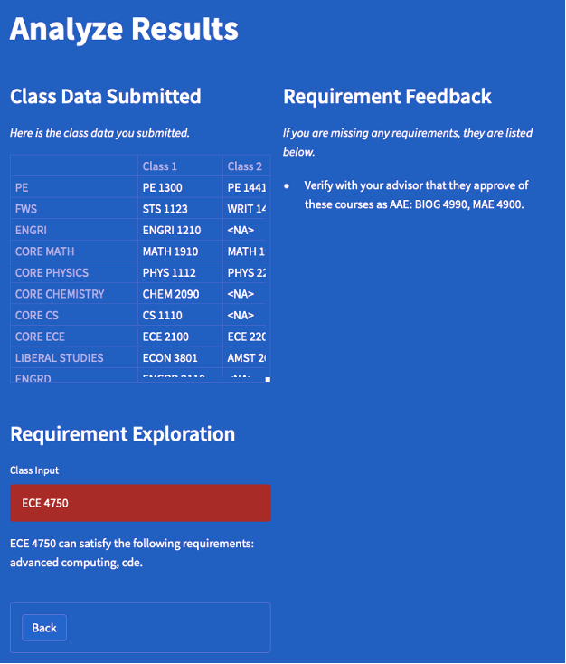

# Graduation-Requirements-Validator

## Abstract
Graduation can be a stressful time for many students, especially if they are concerned about meeting all requirements. Students frequently ask faculty members and advisors to clarify these requirements since some are complex. There isn’t one resource that states all the requirements for students. I developed a graduation validator to automate this process, specifically for Cornell Electrical and Computer Engineering students. Students can input the classes they have taken and understand the requirements they are missing. Students can also explore the requirements that specific classes satisfy. Overall, this application can improve the lives of many students and faculty members.

## Application

View the Streamlit Deployment [here](https://share.streamlit.io/roninsharma25/graduation-requirements-validator/main)

## Application Screenshots

### Home Page

### Download/Update Page

### Analysis Page

## Contact
Ronin Sharma (rrs234@cornell.edu)

## Citation
Please cite this repository if you decide to use it.
